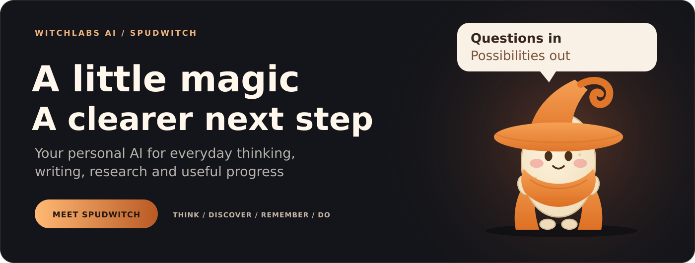
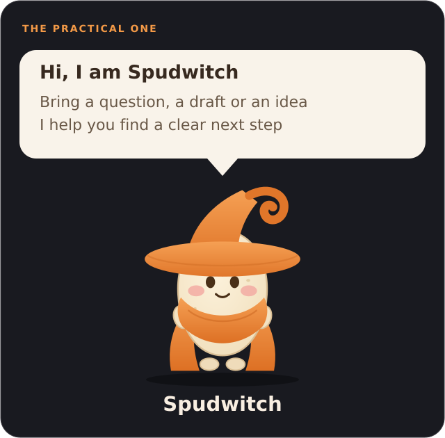
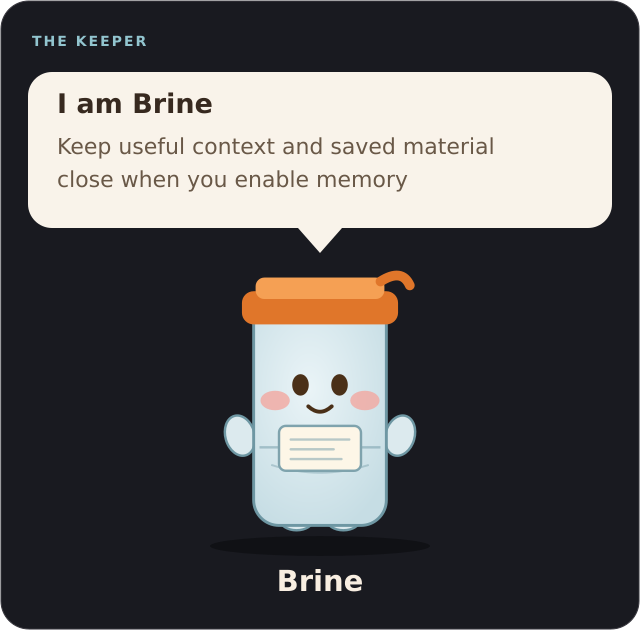
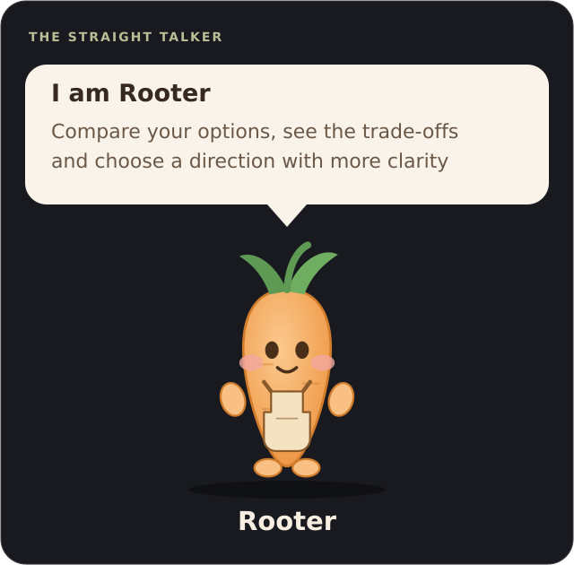
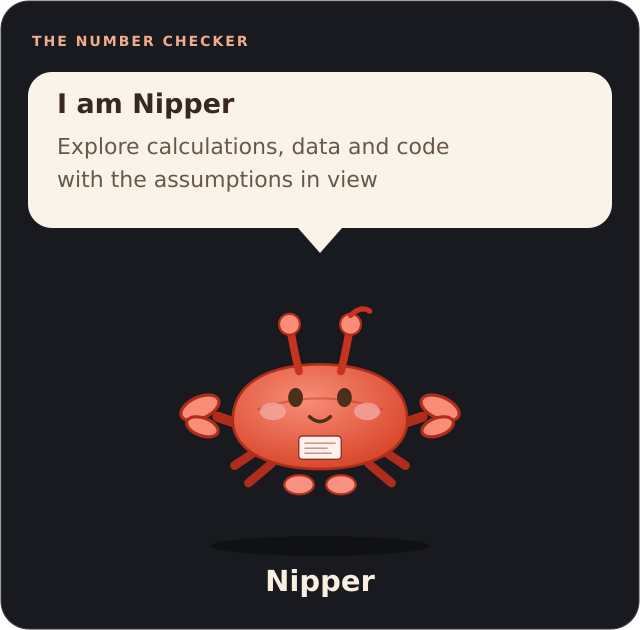
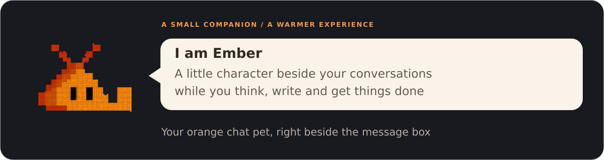
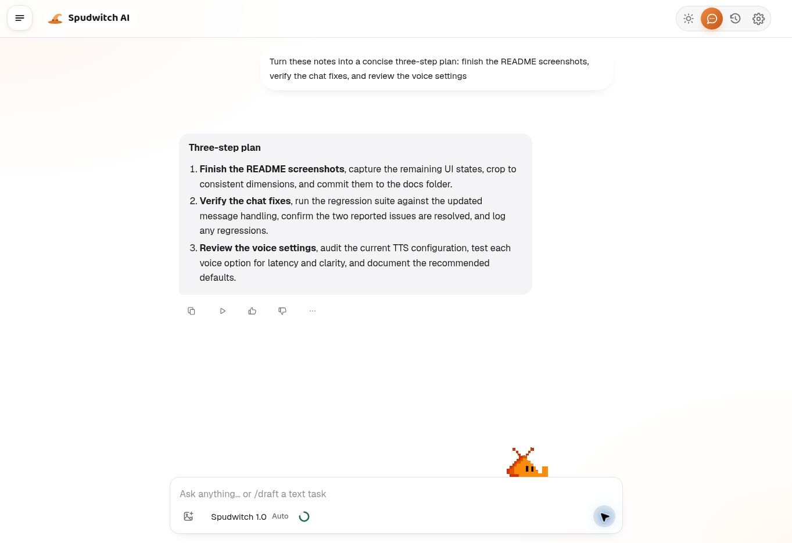
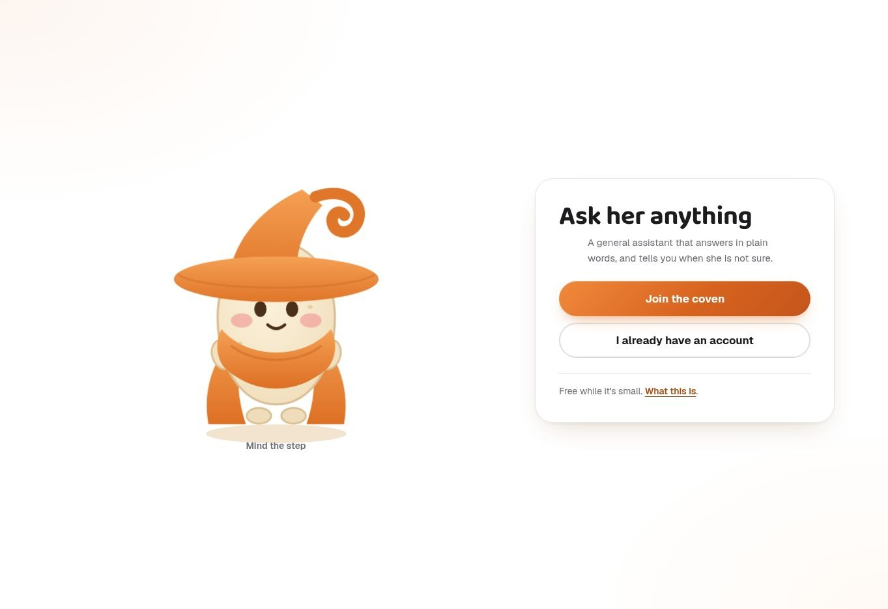
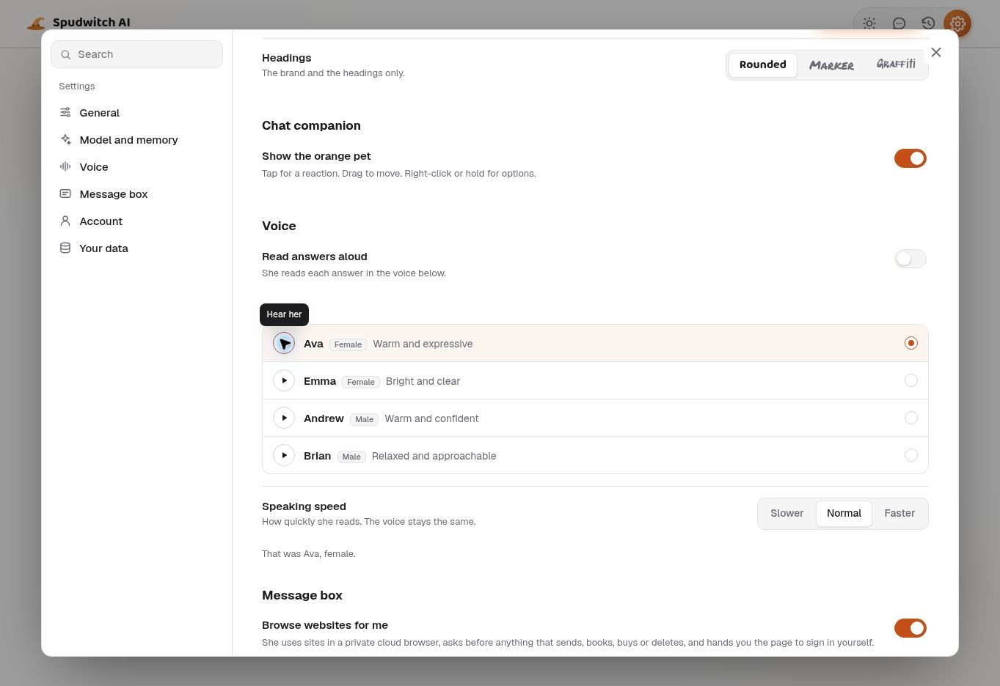
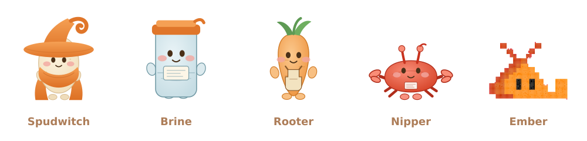

  

  <a href="https://spudwitch.web.app"><strong>Open Spudwitch ↗</strong></a> ·
  <a href="#capabilities">Capabilities</a> ·
  <a href="#meet-your-companions">Companions</a> ·
  <a href="#inside-spudwitch">Screenshots</a> ·
  <a href="#platform-availability">Versions</a>

## About the project

<table>
  <tr>
    <td width="24%" align="center">
      
    </td>
    <td width="76%">
      <strong>Your personal AI, with a little magic</strong>  
      Spudwitch brings conversations, research, writing and personal context into one welcoming experience, created by <strong>WitchLabs Ai</strong>  
      Bring a question, rough draft or idea and work towards a clearer next step  
      This is the official public showcase, featuring artwork and selected screenshots
    </td>
  </tr>
</table>

## Capabilities

| For your next step | Spudwitch can help you |
| --- | --- |
| **Think and write** | Understand a topic, explore ideas and turn notes into clear writing |
| **Discover** | Search online, read linked pages and compare information with sources |
| **Remember** | Work with saved material and preferences when you enable memory |
| **Check and build** | Work through calculations and get help with code |
| **Get things done** | Use supported reminders, attachments, exports and read-aloud tools |

> [!NOTE]
> Features depend on your account, permissions and connected services

## Meet your companions

Four AI companions with different manners, plus Ember, your little chat pet

<table>
  <tr>
    <td width="50%" align="center"></td>
    <td width="50%" align="center"></td>
  </tr>
  <tr>
    <td align="center"></td>
    <td align="center"></td>
  </tr>
</table>

  

## Inside Spudwitch

   
  From scattered notes to a useful plan

<strong>See the welcome screen and voice settings</strong>

<table>
  <tr>
    <td width="50%" align="center"> A warmer welcome</td>
    <td width="50%" align="center"> A voice that fits</td>
  </tr>
</table>

## Platform availability

| Version | Status |
| --- | --- |
| **[Website ↗](https://spudwitch.web.app)** | Available now |
| **Android Version** | In development |
| **PC Version** | Still in development |

Public download links will appear here when ready

## Support the project

[Report a bug](https://github.com/rodri2482/spudwitch/issues/new?template=bug_report.yml) · [Suggest an improvement](https://github.com/rodri2482/spudwitch/issues/new?template=feature_request.yml) · [Check existing issues](https://github.com/rodri2482/spudwitch/issues)

<strong>Reporting and contribution guide</strong>

Describe what you were trying to do, the steps to reproduce a problem and your browser or device
For suggestions, explain the problem your idea would solve

> [!IMPORTANT]
> Reports are public — remove personal information, private conversations, passwords and API keys

Artwork, accessibility and documentation suggestions are welcome
The application source is maintained separately in a private repository

---

   
  <strong>Spudwitch · WitchLabs Ai</strong> 
  Created August 15, 2026 · Think · Discover · Remember · Do  
  <a href="https://spudwitch.web.app"><strong>Open Spudwitch ↗</strong></a> ·
  <a href="#about-the-project">About</a> ·
  <a href="#platform-availability">Versions</a> ·
  <a href="#support-the-project">Support</a>

