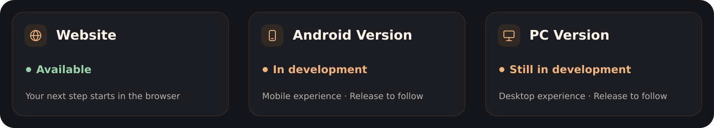
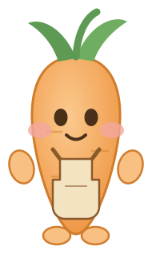
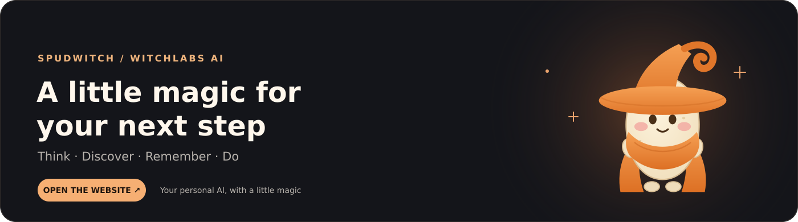

  

  <em>Your personal AI, with a little magic</em> 
  <em>Think clearly, discover more and turn ideas into useful progress</em>

  
  
  

  <a href="https://spudwitch.web.app"><strong>Open Spudwitch ↗</strong></a> ·
  <a href="#meet-your-companions">Meet the companions</a> ·
  <a href="#capabilities">Capabilities</a> ·
  <a href="#inside-spudwitch">Screenshots</a> ·
  <a href="#about-the-project">About the project</a> ·
  <a href="#platform-availability">Versions</a> ·
  <a href="#how-can-i-support-the-project">Support the project</a>

## About Spudwitch

**Your personal AI, with a little magic**

Spudwitch brings conversations, research, writing, personal memory and everyday workflows into one welcoming experience — created by **WitchLabs Ai**

Bring a question, scattered notes or a rough idea, then work towards something useful: a clearer explanation, a better draft, a comparison or your next step

## Meet your companions

Four AI companions, each with a different manner, plus Ember, your little chat pet

<table>
  <tr>
    <td width="50%" align="center"></td>
    <td width="50%" align="center"></td>
  </tr>
  <tr>
    <td align="center"></td>
    <td align="center"></td>
  </tr>
</table>

  

## Capabilities

| A little help with… | What you can do |
| --- | --- |
| **Conversations and writing** | Explore ideas, understand a topic, draft messages and turn rough notes into clear writing |
| **Research** | Search online, read linked pages and compare information with supporting sources |
| **Personal context** | Keep useful preferences and work with saved material when you choose to use memory and your library |
| **Calculations and code** | Work through numbers, inspect assumptions and get help understanding or writing code |
| **Everyday workflows** | Work with reminders, attachments and exports through supported tools, with confirmation for writes and consequential actions |
| **Read aloud** | Listen to responses, choose a voice and adjust the reading speed |
| **Your experience** | Choose New or Classic styling and a companion manner, with Ember beside the conversation |
| **Platform access** | Use the available website, with Android and PC versions in development |

Available features depend on your account, permissions and connected services

## Inside Spudwitch

**Real app screenshots, including a demonstration conversation**

   
  <strong>From scattered notes to a useful plan</strong> 
  A focused conversation, with your companion beside it

<table>
  <tr>
    <td width="50%" align="center">
       
      <strong>A warmer welcome</strong> A familiar face from the first hello
    </td>
    <td width="50%" align="center">
       
      <strong>A voice that fits</strong> Choose how your responses sound
    </td>
  </tr>
</table>

## Start with something small

| You bring… | Try asking… |
| --- | --- |
| **An idea** | “Turn these notes into a plan with three priorities” |
| **A decision** | “Compare these options, explain the trade-offs and list what still needs checking” |
| **A rough draft** | “Make this message clearer while keeping my tone” |
| **A calculation** | “Check this calculation and show the assumptions” |

## Platform availability

  

| Version | Status | Access |
| --- | --- | --- |
| **Website** | **Available** | [Open Spudwitch ↗](https://spudwitch.web.app) |
| **Android Version** | **In development** | Release details will be added here when ready |
| **PC Version** | **Still in development** | Release details will be added here when ready |

## Start using Spudwitch

> [!NOTE]
> The website is available now
> Android and PC versions are still in development, and their public download links will appear here when ready

### Website

- **[Open Spudwitch ↗](https://spudwitch.web.app)** in your browser and sign in to begin

### Android Version

- **In development** — follow this page for public release details

### PC Version

- **Still in development** — follow this page for public release details

## About the project

<table>
  <tr>
    <td width="28%" align="center">
       
      <strong>Your companion for the next step</strong>
    </td>
    <td width="72%">
      <strong>A little character, a practical purpose</strong>  
      Spudwitch is a personal AI project by <strong>WitchLabs Ai</strong>, built around a simple goal: help people think, discover, remember and get things done through a characterful, approachable assistant  
      This repository is the official public showcase: product introductions, companion artwork and selected screenshots 
      The application source is maintained separately in a private repository
    </td>
  </tr>
</table>

### Character lineup

**Spudwitch · Brine · Rooter · Nipper · Ember**

The familiar faces from the app, shown as individual transparent cutouts

<table>
  <tr>
    <td align="center" width="20%"> <strong>Spudwitch</strong></td>
    <td align="center" width="20%"> <strong>Brine</strong></td>
    <td align="center" width="20%"> <strong>Rooter</strong></td>
    <td align="center" width="20%"> <strong>Nipper</strong></td>
    <td align="center" width="20%"> <strong>Ember</strong></td>
  </tr>
</table>

## How can I support the project?

You can help Spudwitch improve by [sharing an idea](https://github.com/rodri2482/spudwitch-showcase/issues/new?template=feature_request.yml), [reporting a bug](https://github.com/rodri2482/spudwitch-showcase/issues/new?template=bug_report.yml) or introducing the [website](https://spudwitch.web.app) to someone who would find it useful

## Bug reporting

Before opening a report, [check existing issues](https://github.com/rodri2482/spudwitch-showcase/issues) to see whether the same problem has already been raised

Include what you were trying to do, the steps to reproduce the problem, what you expected and what actually happened
Add your browser or device details and a screenshot if it helps explain the issue

> [!IMPORTANT]
> Public reports are visible to everyone
> Remove personal information, private conversations, passwords and API keys from screenshots and reports

**[Report a bug →](https://github.com/rodri2482/spudwitch-showcase/issues/new?template=bug_report.yml)**

## Contributor guide

<strong>Artwork, documentation and product feedback</strong>

### Working on Spudwitch

This public repository contains the product showcase, character artwork and selected screenshots

- **Documentation** — suggest clearer descriptions, correct a broken link or improve accessibility text
- **Design** — share feedback on the characters, layout or presentation
- **Product ideas** — describe the problem you want Spudwitch to solve and how the feature would help

Keep contributions focused on the public showcase
The application source is maintained separately

**[Suggest an improvement →](https://github.com/rodri2482/spudwitch-showcase/issues/new?template=feature_request.yml)**

---

  

<table>
  <tr>
    <td width="33%" align="center">
      <strong>EXPLORE</strong>  
      <a href="#meet-your-companions">Meet the companions</a> 
      <a href="#capabilities">Capabilities</a> 
      <a href="#inside-spudwitch">Inside Spudwitch</a>
    </td>
    <td width="34%" align="center">
      <strong>VERSIONS</strong>  
      <a href="https://spudwitch.web.app">Website · Available ↗</a> 
      <a href="#platform-availability">Android Version · In development</a> 
      <a href="#platform-availability">PC Version · In development</a>
    </td>
    <td width="33%" align="center">
      <strong>THE PROJECT</strong>  
      <a href="#about-the-project">About the project</a> 
      <a href="#how-can-i-support-the-project">Support the project</a> 
      <a href="#bug-reporting">Report a bug</a> 
      <a href="#about-spudwitch">Back to the introduction ↑</a>
    </td>
  </tr>
</table>

    
  <strong>Spudwitch · WitchLabs Ai</strong> 
  Created August 15, 2026 · Think, discover, remember and get things done

